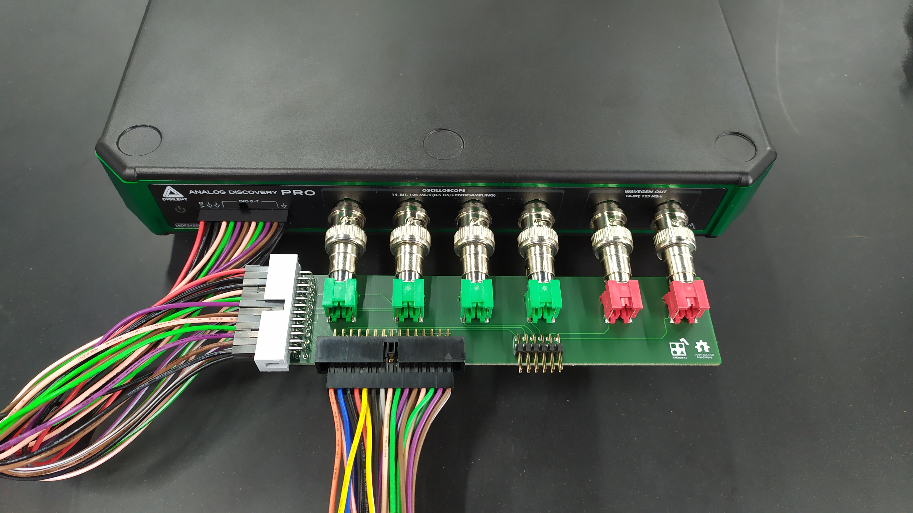
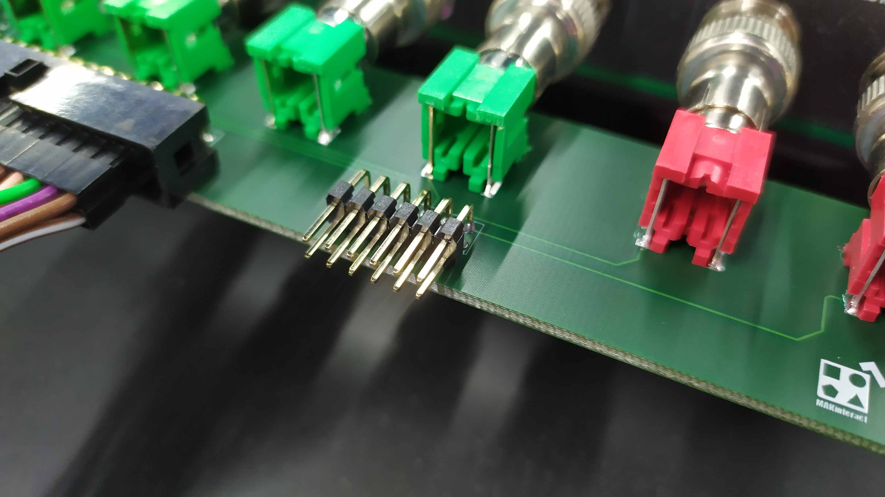

# DiscoveryPro Adapter

Hardware files for a simple adapter to be used with the [Digilent Discovery Pro 3000 series](https://digilent.com/shop/analog-discovery-pro-3000-series-portable-high-resolution-mixed-signal-oscilloscopes/).

Schematics and PCB can be quickly seen [here](./DiscoveryProAdapter_Altium.PDF). Gerber files are [here](./DiscoveryProAdapter_Altium/Project%20Outputs%20for%20DiscoveryProAdapter_Altium/Gerber).

**Use at your own risk**.

### Example usages

Simply forwarding oscilloscope probes to the ribbon cable (CH1 and CH2) and waveform generator channels (W1 and W2).

Exposing all the digital pins to the front panel.

Exposing all channels (CH1-CH4 and W1-W2) and relative ground pins.

